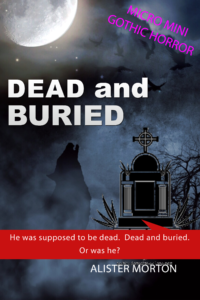

[Skip to content](index.html%3Fp=83.html#content){.skip-link
.screen-reader-text}

::: {#site-header .site-header .dynamic-header .menu-dropdown-tablet}
::: header-inner
::: {.site-branding .show-title}
::: {.site-title .show}
[Xania Books](index.html "Home"){rel="home"}
:::

Stimulate Your Brain
:::
:::
:::

::: {#content .site-main .post-83 .page .type-page .status-publish .has-post-thumbnail .hentry role="main"}
::: page-header
# BookShop {#bookshop .entry-title}
:::

::: page-content
## FICTION BOOKS {#fiction-books style="text-align: center;"}

 

[{.alignnone
.wp-image-24 decoding="async" width="154" height="231"
srcset="wp-content/uploads/2020/11/Dead-and-Buried-Micro-Mini-Gothic-Horror-2-200x300.png 200w, wp-content/uploads/2020/11/Dead-and-Buried-Micro-Mini-Gothic-Horror-2-683x1024.png 683w, wp-content/uploads/2020/11/Dead-and-Buried-Micro-Mini-Gothic-Horror-2-768x1152.png 768w, wp-content/uploads/2020/11/Dead-and-Buried-Micro-Mini-Gothic-Horror-2-1024x1536.png 1024w, wp-content/uploads/2020/11/Dead-and-Buried-Micro-Mini-Gothic-Horror-2-1365x2048.png 1365w, wp-content/uploads/2020/11/Dead-and-Buried-Micro-Mini-Gothic-Horror-2.png 1800w"
sizes="(max-width: 154px) 100vw, 154px"}](https://amzn.to/2UDyiNr){target="_blank"
rel="noopener noreferrer"}

#### **[Dead and Buried](https://amzn.to/2UDyiNr){target="_blank" rel="noopener noreferrer"}, by Alister Morton**

He was supposed to be dead. Dead and buried. Or was he? (*The Selenics*
Book 1)

A mystery romance with a vampire twist -- or is it? The White Worm could
be behind it all, but Claire doesn't think so. Her husband died of an
accident on his farm estate, simple as that. But why do mysterious
events keep happening after his death -- even at the funeral? Who are
those strange women, a 'sisterhood' hanging around the village
accompanied by a group of teenage girls dressed in bright red dresses?
It's a micro mini gothic romance series with a hint of something wicked
in the air.

**[Click Here](https://amzn.to/2vg4psr){target="_blank"
rel="noopener noreferrer"} to Buy on Amazon**

 

 

[{.alignnone
.wp-image-26 decoding="async" width="152" height="228"
srcset="wp-content/uploads/2020/11/The-Blooding-Selenics-2-200x300.jpg 200w, wp-content/uploads/2020/11/The-Blooding-Selenics-2-683x1024.jpg 683w, wp-content/uploads/2020/11/The-Blooding-Selenics-2-768x1152.jpg 768w, wp-content/uploads/2020/11/The-Blooding-Selenics-2-1024x1536.jpg 1024w, wp-content/uploads/2020/11/The-Blooding-Selenics-2-1365x2048.jpg 1365w, wp-content/uploads/2020/11/The-Blooding-Selenics-2-scaled.jpg 1707w"
sizes="(max-width: 152px) 100vw, 152px"}](https://amzn.to/2vr2JMI){target="_blank"
rel="noopener noreferrer"}

#### **[The Blooding](https://amzn.to/2vr2JMI){target="_blank" rel="noopener noreferrer"}, by Alister Morton**

She was alone, 50 miles from anywhere -- with two strange men. The red
stuff was flowing...

Perhaps she shouldn't have crossed swords with 'Kill-On', when the food
delivery arrived -- in a police car. Strange happenings with a shiver of
tension in this micro mini short story, a fusion of horror and humour. A
quick read to capture the imagination, the second in *The Selenics*
trilogy.

**[Click Here](https://amzn.to/3cOPhD7){target="_blank"
rel="noopener noreferrer"} to Buy on Amazon**

 

 

[{.alignnone
.wp-image-9 decoding="async" width="156" height="234"
srcset="wp-content/uploads/2020/10/The-Homecomingx-200x300.jpg 200w, wp-content/uploads/2020/10/The-Homecomingx-683x1024.jpg 683w, wp-content/uploads/2020/10/The-Homecomingx-768x1152.jpg 768w, wp-content/uploads/2020/10/The-Homecomingx-1024x1536.jpg 1024w, wp-content/uploads/2020/10/The-Homecomingx-1365x2048.jpg 1365w, wp-content/uploads/2020/10/The-Homecomingx-scaled.jpg 1707w"
sizes="(max-width: 156px) 100vw, 156px"}](https://amzn.to/2vak2S1){target="_blank"
rel="noopener noreferrer"}

#### **[The Homecoming](https://amzn.to/2vak2S1){target="_blank" rel="noopener noreferrer"}, by Alister Morton**

Darkness fell, and the heightened sense of blood running through distant
veins grew stronger and stronger...\
A deadly trio arrive and immediately make their presence felt. Killer
dogs are on the loose, or is it the White Worm again? No-one dare speak
the word -- 'vampire'. And yet, how many more plots will be claimed in
the peaceful graveyard before the village can rest in peace?

Strange happenings have become normal in the sleepy Derbyshire Peaks,
and the curse of the Darbys seems to be all too real. But there are so
many unanswered questions.

A quick read to capture the imagination, the third in *The Selenics*
trilogy.

**[Click Here](https://amzn.to/2TSkCfI){target="_blank"
rel="noopener noreferrer"} to Buy on Amazon**

 

 

[{.wp-image-25
.aligncenter loading="lazy" decoding="async" width="156" height="234"
srcset="wp-content/uploads/2020/11/The-Ageless-Onesx-200x300.jpg 200w, wp-content/uploads/2020/11/The-Ageless-Onesx-683x1024.jpg 683w, wp-content/uploads/2020/11/The-Ageless-Onesx-768x1152.jpg 768w, wp-content/uploads/2020/11/The-Ageless-Onesx-1024x1536.jpg 1024w, wp-content/uploads/2020/11/The-Ageless-Onesx-1365x2048.jpg 1365w, wp-content/uploads/2020/11/The-Ageless-Onesx-scaled.jpg 1707w"
sizes="(max-width: 156px) 100vw, 156px"}](https://amzn.to/3aYgcus){target="_blank"
rel="noopener noreferrer"}

#### **[The Ageless Ones](https://amzn.to/3aYgcus){target="_blank" rel="noopener noreferrer"}, by Alister Morton** {#the-ageless-ones-by-alister-morton style="text-align: center;"}

***The Selenics Trilog***y

Three mysterious tales with a vampire twist -- or is it? The White Worm
could be behind it all, but Claire doesn't think so. Her husband died in
an accident on his farm estate, simple as that. But why do mysterious
events keep happening after his death -- even at the funeral? Who are
those strange women, a 'sisterhood' hanging around the village
accompanied by a group of teenage girls dressed in bright red dresses?
After all, he was supposed to be dead. Dead and buried. Or was he?

In the second story, she was alone, 50 miles from anywhere -- with two
strange men. The red stuff was flowing...Perhaps she shouldn't have
crossed swords with 'Kill-On', when the food delivery arrived -- in a
police car. It could have been the last thing she ever did.

Strange happenings with a shiver of tension continue in the third story,
as darkness falls and the heightened sense of blood running through
distant veins grew stronger and stronger...A deadly trio have arrived
and immediately make their presence felt. Killer dogs are on the loose,
or is it the White Worm again? No-one dare speak the word -- 'vampire'.
And yet, how many more plots will be claimed in the peaceful graveyard
before the village can rest in peace?

Be warned. You may find that this mini-micro gothic horror series has a
discomforting proximity to your day-to-day life.

**[Click Here](https://amzn.to/39WaHwc){target="_blank"
rel="noopener noreferrer"} to Buy on Amazon**

 

 

[{.alignnone
.wp-image-85 loading="lazy" decoding="async" width="157" height="251"
srcset="wp-content/uploads/2020/11/The-Night-Bus-188x300.png 188w, wp-content/uploads/2020/11/The-Night-Bus-640x1024.png 640w, wp-content/uploads/2020/11/The-Night-Bus-768x1229.png 768w, wp-content/uploads/2020/11/The-Night-Bus-960x1536.png 960w, wp-content/uploads/2020/11/The-Night-Bus-1280x2048.png 1280w, wp-content/uploads/2020/11/The-Night-Bus.png 1600w"
sizes="(max-width: 157px) 100vw, 157px"}](https://amzn.to/2OIcNaC){target="_blank"
rel="noopener noreferrer"}

#### **[The Night Bus](https://amzn.to/2OIcNaC){target="_blank" rel="noopener noreferrer"}, and other stories, by Alister Morton**

Three short stories to grab your imagination at Halloween or in the dead
of night and twist your mind to contemplate the unknown. Fear of what
might have been, or what might be to come. You will never ride a bus
again without thinking of the darkness that may await you at the
terminus. These quick reads will linger long in your imagination.

This scary collection starts with *Halloween Fun*, carries you along to
*Party Time*, and finally, very finally, leads you on to *The Night
Bus*.

Set in and around a fictional Oxford which you won't want to visit, you
will never look at the dreaming spires in the same way again. Oxford's
buses are woven into the stories, leading you to a deadly Halloween
party -- or is it? Was this the party that they had been invited to --
or a different one? And who, exactly, had invited them?

An unworldly seance in Wytham woods -- or is that really what it is?
What happened to the last passenger who vanished, and what happened on
the bus when it mysteriously ground to a halt on the night before
Halloween? And remember, Senorita Muerta, don't drink the wine.

Three micro-reads, short stories to stir your imagination at a lunch
break, while travelling to and from work or even, if you dare, on **the
Night Bus**.

**[Click Here](https://amzn.to/3cRpLNF){target="_blank"
rel="noopener noreferrer"} to Buy on Amazon**

 

 

 

## NON-FICTION BOOKS {#non-fiction-books style="text-align: center;"}

 

### FITNESS BOOKS

 

[{.alignnone
.wp-image-87 loading="lazy" decoding="async" width="149" height="226"
srcset="wp-content/uploads/2020/11/41UUURJtNDL._SX331_BO1204203200_-198x300.jpg 198w, wp-content/uploads/2020/11/41UUURJtNDL._SX331_BO1204203200_.jpg 316w"
sizes="(max-width: 149px) 100vw, 149px"}](https://amzn.to/2OGVdnn){target="_blank"
rel="noopener noreferrer"}

#### [**Easy Fitness for Over 40s**](https://amzn.to/2OGVdnn){target="_blank" rel="noopener noreferrer"}

***How to get fit and stay fit in just 20 minutes a day***

I called this course 'Easy' because that's exactly what it is. The
exercises should take less than 20 minutes to complete, and although you
will certainly feel that you have made an effort, you should never have
to find yourself pushing through any 'pain barrier'.

I first started doing the exercise routines described in this book when
in my mid-forties. I quickly became as fit as I can remember feeling
since my youth. Then, inexplicably, I became over-confident in my
new-found fitness and let it lapse -- for much too long. Fast-forward to
my mid-fifties and I had become an overweight, grossly unfit couch
potato. Luckily, I was able to muster up the motivation to revisit these
exercise routines from my past and have since become as fit as I can
remember being since my mid-forties. However, it took much more effort.
Don't let this happen to you.

You are now in your forties, the prime of life. Start now, keep at it,
and you will never regret it. Your future health, and life expectancy,
is in your hands. I can guarantee that, if you follow the steps set out
in this book, you will feel a real difference in just a few weeks.

Are you ready to commit to your future and follow your fitness plan for
life?

**[Click Here](https://amzn.to/2vfbXeR){target="_blank"
rel="noopener noreferrer"} to Buy on Amazon**

 

 

[{.alignnone
.wp-image-86 loading="lazy" decoding="async" width="150" height="225"
srcset="wp-content/uploads/2020/11/41O7PxP8QSL._SX331_BO1204203200_-1-200x300.jpg 200w, wp-content/uploads/2020/11/41O7PxP8QSL._SX331_BO1204203200_-1.jpg 333w"
sizes="(max-width: 150px) 100vw, 150px"}](https://amzn.to/2HaPVfS){target="_blank"
rel="noopener noreferrer"}

#### [**Easy Fitness for Over 50s**](https://amzn.to/2HaPVfS){target="_blank" rel="noopener noreferrer"}

***Your Fitness Plan For Life***

A Proven Method To Regain Your Fitness, Improve Your Appearance And Lose
Weight.

Are you over 50 and determined to make a new start? Then you have
finally reached the right place to begin your journey to the easy
fitness you once enjoyed. Now, not tomorrow, not in 12 months' time.

*Easy Fitness for Over 50s* is a low impact fitness regime that will
take you just minutes a day, while following a normal, healthy
lifestyle. If you are trying to lose weight then you have probably tried
one diet after another and got nowhere.

You could just gain fitness instead. Weight-loss becomes irrelevant as
you become fitter. You may not lose pounds, but you will gain muscle,
and shape, and health, through a painless process, one that you can
maintain as the years go by, keeping up an age-defying youthful aura as
you head towards your sixties, seventies, and beyond.

**[Click Here](https://amzn.to/2W8jJSS){target="_blank"
rel="noopener noreferrer"} to Buy on Amazon**

 

 

[{.alignnone
.wp-image-88 loading="lazy" decoding="async" width="150" height="225"
srcset="wp-content/uploads/2020/11/41q9Dsf6hL._SX331_BO1204203200_-1-200x300.jpg 200w, wp-content/uploads/2020/11/41q9Dsf6hL._SX331_BO1204203200_-1.jpg 333w"
sizes="(max-width: 150px) 100vw, 150px"}](https://amzn.to/2OI0fzR){target="_blank"
rel="noopener noreferrer"}

#### [**Easy Fitness for Easy Weight Loss**](https://amzn.to/2OI0fzR){target="_blank" rel="noopener noreferrer"}

***What To Actually DO To Start Losing Weight Quickly***

Just 12 short weeks to a New You. Did you gain weight relentlessly over
the Christmas season? Do you have a wedding, a beach vacation, or a job
interview within the next few weeks?

Your solution for *Easy Weight Loss* -- combined with Easy Fitness, now
and far into the future -- can be found right here. There is no need to
go on a crash diet. No need to spend hours sweating it out in the gym.
Just follow this sequence of easy weight loss exercises.

Every single element of the *Easy Fitness-Easy Weight Loss* plan can be
achieved through exercise at home, using no specialized gym equipment,
while applying your choice of one of the specific dietary plans based on
Clean Eating. You won't go hungry on either of these weight-loss plans.
You should lose weight fast, easily shedding 10 pounds within 30 days,
and go on to lose further weight and gain increased fitness over the
course of the full 12-week fitness workout plan.

Not only that, but it is Easy!

Just 20 minutes of home workouts every day, along with weight loss tips
involving a general increase in activity and a focus on what you are
consuming -- that is all you need to welcome in that New You which is
waiting to appear in 12 weeks from now.

Start today and you will find weight and fitness ceases to be a problem.
Why would you ever choose to stop?

"The book you don't read won't help" -- Jim Rohn

**[Click Here](https://amzn.to/2wL3kJr){target="_blank"
rel="noopener noreferrer"} to Buy on Amazon**

 

 

### MISCELLANEOUS BOOKS

 

[{.alignnone
.wp-image-89 loading="lazy" decoding="async" width="151" height="241"
srcset="wp-content/uploads/2020/11/51Qdj7Qw9jL._SX311_BO1204203200_-188x300.jpg 188w, wp-content/uploads/2020/11/51Qdj7Qw9jL._SX311_BO1204203200_.jpg 313w"
sizes="(max-width: 151px) 100vw, 151px"}](https://amzn.to/2vWZAnF){target="_blank"
rel="noopener noreferrer"}

#### [**Slug Prevention the Natural Way**](https://amzn.to/2vWZAnF){target="_blank" rel="noopener noreferrer"}

***A Slugpedia for Getting Rid of Slugs***

If you want to stop slugs in their tracks, Slug Prevention the natural
way is your answer to organic slug control in an environmentally
friendly way.

*Slug Prevention the natural way* should be added to your library of
books on organic gardening as a comprehensive A-Z of methods for getting
rid of slugs -- without using chemicals, which may be harmful to
children, pets and wildlife.\
If you need to develop a slug control plan to get rid of slugs and
snails you will find that this book will give you all the armament you
will ever need.

Just beginning organic gardening? This is one of those organic garden
books that you will find indispensable. Including over 100 ways of DIY
garden pest control for deterring, preventing or killing garden slugs by
combinations of barriers, traps, deadly slug killer sprays, and
encouraging natural predators, you need never again be in want of a slug
repellent.

The organic gardener needs access to the best garden pest control
methods, and the best slug control is natural slug control. Packed with
organic garden tips including:

-   Non-toxic slug control
-   Organic slug control for the vegetable garden
-   DIY garden slug control methods
-   Slug control in the house

Natural garden slug prevention for the organic garden. One of those
organic gardening books you will never want to be without.

**[Click Here](https://amzn.to/2QosV1Z){target="_blank"
rel="noopener noreferrer"} to Buy on Amazon**

 

 

[{.alignnone
.wp-image-90 loading="lazy" decoding="async" width="151" height="227"
srcset="wp-content/uploads/2020/11/512COlf4DRL-200x300.jpg 200w, wp-content/uploads/2020/11/512COlf4DRL.jpg 333w"
sizes="(max-width: 151px) 100vw, 151px"}](https://amzn.to/31HQA1F){target="_blank"
rel="noopener noreferrer"}

#### [**Time Management for Busy Parents**](https://amzn.to/31HQA1F){target="_blank" rel="noopener noreferrer"}

***Family Time Management Tips to Relieve Stress and Time Pressure***

Sometimes you can be too busy as a parent to really enjoy it, then
before you know it your children have grown up and fled the nest. These
time management tips for busy parents are a quick read, with actionable
steps which will really help with parenting stress management as well as
providing useful time management strategies for children. Don't
underestimate the value of your child learning good habits to last a
lifetime, and these time management skills for kids go hand in hand with
the time management techniques for parents which will relieve stress and
time pressure on your life.

Chapters in this book include:

-   Decluttering Your Mind & Space
-   Organizational Fundamentals
-   Streamlining Paperwork
-   Children's Clutter.

They are packed with practical time management steps, showing you what
to do next, how to avoid procrastination, saving time, the art of
delegation and steadily bringing order to the chaos of a disorganized
life. *Time Management for Busy Parents* will ease you into the best
time management habits. In fact you could call it easy time management.

**[Click Here](https://amzn.to/3cTTG7J){target="_blank"
rel="noopener noreferrer"} to Buy on Amazon**

 

 

[{.alignnone
.wp-image-91 loading="lazy" decoding="async" width="151" height="227"
srcset="wp-content/uploads/2020/11/Oxford-for-free-200x300.jpg 200w, wp-content/uploads/2020/11/Oxford-for-free-683x1024.jpg 683w, wp-content/uploads/2020/11/Oxford-for-free-768x1152.jpg 768w, wp-content/uploads/2020/11/Oxford-for-free-1024x1536.jpg 1024w, wp-content/uploads/2020/11/Oxford-for-free-1365x2048.jpg 1365w, wp-content/uploads/2020/11/Oxford-for-free-scaled.jpg 1707w"
sizes="(max-width: 151px) 100vw, 151px"}](https://amzn.to/2Q9y8uf){target="_blank"
rel="noopener noreferrer"}

#### [**Oxford for Free**](https://amzn.to/2Q9y8uf){target="_blank" rel="noopener noreferrer"}

***Top Ten Hidden Secrets of Oxford***

Your guide to 10 special aspects of Oxford that most tourists never see,
all free to see and to enter.

Packed with tips from your Expert Local Guide, you can act like a local
and reach the parts of Oxford that other tourists don't reach, and learn
about the city along the way.

Learn about the special routes and short-cuts to places often hidden in
plain sight; the best times to visit, the best places to go to avoid the
crowds, the best places to take photographs of the Oxford skyline.

Packed with contemporary information and historical backgrounds, with
Expert Tips to follow which will help you get the best out of this
glorious city.

There is no need to act like a tourist when you have this guide in your
hand, written by a local expert.

Enjoy your visit to Oxford and make the most of it.

**[Click Here](https://amzn.to/2TWLV8I){target="_blank"
rel="noopener noreferrer"} to Buy on Amazon**

 

 

[{.alignnone
.wp-image-92 loading="lazy" decoding="async" width="153" height="230"
srcset="wp-content/uploads/2020/11/50-side-hustles-200x300.jpg 200w, wp-content/uploads/2020/11/50-side-hustles-683x1024.jpg 683w, wp-content/uploads/2020/11/50-side-hustles-768x1152.jpg 768w, wp-content/uploads/2020/11/50-side-hustles-1024x1536.jpg 1024w, wp-content/uploads/2020/11/50-side-hustles-1365x2048.jpg 1365w, wp-content/uploads/2020/11/50-side-hustles-scaled.jpg 1707w"
sizes="(max-width: 153px) 100vw, 153px"}](https://amzn.to/36bMO4h){target="_blank"
rel="noopener noreferrer"}

#### [**50 Side Hustles**](https://amzn.to/36bMO4h){target="_blank" rel="noopener noreferrer"}

***To boost your bank account***

More than 50 of the best simple and easy ways to make money without a
job and in your spare time.

Do you want to find the best easy ways to make money online without a
website? Here are over 50 fun easy ways to make money without a job
including some types of part-time and freelance work that you can do to
pick up extra cash online and offline. These are quick easy ways to make
money on the side, and you will have access to over 160 links to
websites offering to give you money in return for time, easy ways to
make money at home.

You will find side hustles which are easy ways to make money from home
for free, as well as how to make money online in college to boost your
bank balance and take care of those college fees. Most of the top easy
ways to make money online can be undertaken in your spare time, often
while doing something else. You are going to learn how to make money
online right now, mostly from anywhere in the world, although some of
these money-making opportunities are exclusive to particular countries.

Looking for easy ways to make money online without investment, or how to
make money online without a website? You've found how to make money
online for free right here. Simple and easy ways to make money, as well
as showing how to make money online for students, these are -- with one
notable exception -- fast and easy ways to make money online without
paying anything but the low price of this book.

**[Click Here](https://amzn.to/39ktTq1){target="_blank"
rel="noopener noreferrer"} to Buy on Amazon**

 
:::
:::

::: footer-inner
::: {.site-branding .show-logo}
Stimulate Your Brain
:::

::: {.copyright .show}
All rights reserved
:::
:::

::: {.wpcbbarloader style="display:none;text-align: center;"}

:::

::: {.wpcb_show_btmc_afflt style="text-align:center;"}
:::
